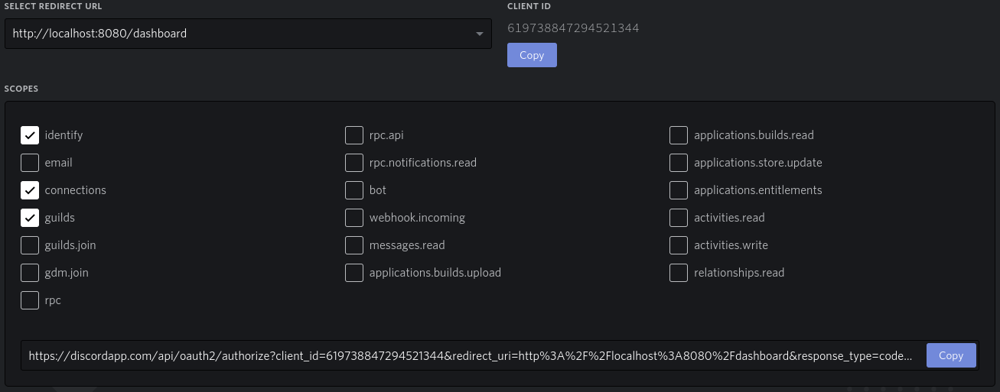

# vocality-web-dashboard

## Development Setup

> npm install

Make sure to have a `.env.local` file in your root directory with the following variables set

```
VUE_APP_DISCORD_CLIENT_ID     (required for login)
VUE_APP_DISCORD_CLIENT_SECRET (required for login)
VUE_APP_YOUTUBE_API_KEY       (required for yt song search)
```

> npm start

## Selfhosting Setup

To use the dashboard for bot you need to add the vocality [music plugin](https://github.com/vocality-org/vocality/tree/master/packages/vocality-music) to your bot.

### Create a Discord App for the Dashboard

The dashboard needs access to the Discord REST Api. Therefore you need to create a Discord App for the Dashboard itself.

Discord Developer Portal: https://discordapp.com/developers/applications

-   Create a new Application
-   Navigate to the OAuth2 Section
-   Add Redirect URLs (here localhost, but replace it with your production URL)
    
-   Generate OAuth2 URLs for each redirect URL used with following **scopes:**
    -   identify
    -   connections
    -   guilds
-   Set the env variables `VUE_APP_DISCORD_REDIRECT_URL` and `VUE_APP_DISCORD_AUTH_URL` in `.env.production`
    

### Dashboard port

By default vocality-music uses port 3000 for websocket connections from the dashboard. If `process.env.PORT` is set the value of the environment variable is used instead.

-   Make sure to set `VUE_APP_SOCKET_URL=` in the `env.production` file.

### Set Dashboard Secrets

See [Development Setup](##Development-Setup) for the secrets to set in `.env.local`.
